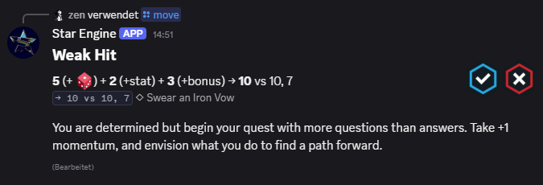

# 🌠 starengine

**starengine** is a Discord bot designed to allow for play of the [Ironsworn: Starforged](https://tomkinpress.com/pages/ironsworn-starforged) roleplaying system over Discord. The bot enables play-by-post gameplay with interactive commands, oracle rolls, and move resolution.



> The bot is not currently available for public use, but can be deployed on your own infrastructure following the instructions in [the Self Hosting section](#self-hosting).

<hr />

## Self Hosting

If you are familiar with hosting Discord bots yourself for personal use, you may deploy this bot on your own server.

Requirements
- [Bun Runtime](https://bun.sh)
- Discord bot token provided as a `DISCORD_TOKEN` environment variable.
  You can obtain one by creating a new bot application on the [Discord Developer Portal](https://discord.com/developers/applications).
  
```bash
# Install dependencies
bun install
# Run the bot
bun run start
```

## Development Setup

```bash
# Install dependencies
bun install
# Run in development mode with auto-reload
bun run dev
# Run in production mode
bun run start
# Run all tests
bun test
# Run specific test file
bun test src/core/custom-id.test.ts
# Lint and format code
bunx @biomejs/biome check --write
```

## Copyright

[© 2025 maradotwebp](LICENSE)
